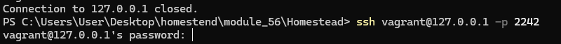
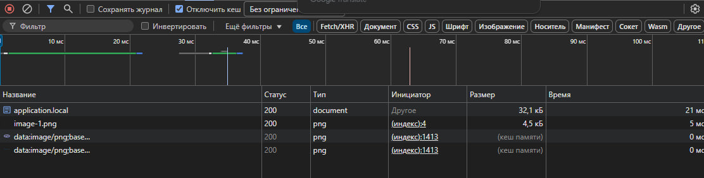

# Модуль 56. Виртуальные машины и Linux

## Описание Проекта

а виртуальной машине работает сайт application.local, который можно вызвать из браузера по соответствующему доменному имени.

## Структура Проекта

1) Машине присвоен адрес 192.168.10.42
2) Имя виртуальной машины: PHP Backend.
### Homestead.yaml :
``` 
ip: "192.168.10.42"
memory: 2048
cpus: 2
provider: virtualbox
name: PHP Backend
 ```
3) Настроен проброс директорий с кодом.
```
folders:
  - map: C:\Users\User\Desktop\homestend\module_56\Homestead\code 
    to: /home/vagrant/code
```
4) Порт SSH проброшен в хостовый порт 2242
5) Настроен проброс порта 443 с виртуальной машины на порт 4430 на хостовой машине.
```
ports:
  - send: 80
    to: 80
  - send: 2242
    to: 22
  - send: 4430
    to: 443
```



6) Сделано так, чтобы Nginx отдавал статические файлы с кэшированием.

Сделал через after.sh - только так получилось прокинуть новый конфиг nginx



## Установка

1. **Склонируйте репозиторий:**

    ``` 
    git clone https://github.com/Volotovskii/VirtualMachines.git
    ```


1.1 Если работаем без впн - в файле  `Homestead/Vagrantfile` добавить строку - ` ENV['VAGRANT_SERVER_URL'] = 'https://vagrant.elab.pro' `

1.2 В файле `Homestead/scripts/homestead.rb` на 25 строке добавить - `     config.vm.box_version = "<= 10.1" `

1.3 В файле `Homestead/bin/wsl-init` заменить `php8.3` на `php8.2`

1.5 Переместите папку `code` в `Homestead` 

1.6 Поменяйте пути в Homestead.yaml и зпустите проект. в host пропишите 192.168.10.42 application.local
